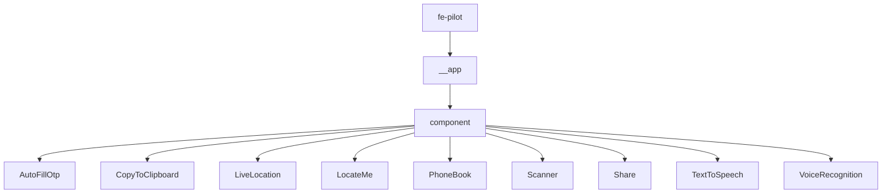
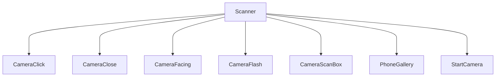
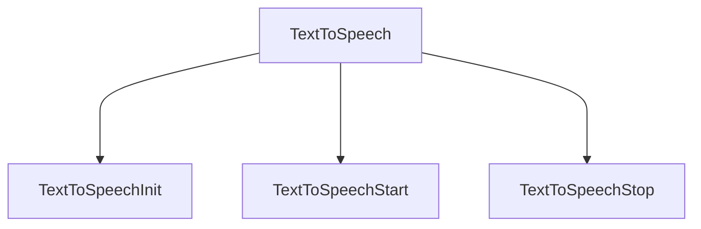
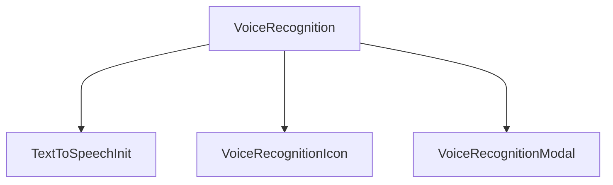

# Setup
Clone the repository and run the following commands from the root directory of fe-pilot

## Local setup

#### 1. Go to the fe-pilot repo location in your terminal and do 
```
npm install
npm start
```

#### 2. Open terminal and Go to any ```working react application``` in your system, where you want to ```implement FE-Theme```

```js
npm link {PATH}/fe-pilot/
```
&nbsp;&nbsp;**Note:** PATH is the location of cloned fe-pilot folder


#### 3. Pass theme config to ThemeProvider 
```js
import PhoneBook from 'fe-pilot/PhoneBook';
import Share from 'fe-pilot/Share';
import { TextToSpeechInit, TextToSpeechStart, TextToSpeechStop } from 'fe-pilot/TextToSpeech';

<PhoneBook />
<Share />
 <TextToSpeechInit text="Password field is not contained in a form: (More info: ">
  <TextToSpeechStart>Start Icon</TextToSpeechStart>
  <TextToSpeechStop>Stop Icon</TextToSpeechStop>
</TextToSpeechInit>
```

#### 4. Hurrah...! Now fe-pilot repo is available inside the node_modules of your project, and waching change in fe-pilot.


## Folder Structure
```
fe-pilot
  └── __app      
    └── component                   
      ├──TextToSpeech                (component name)
      |   ├──TextToSpeech.js         (top level exports/re-exports)
      |   ├──TextToSpeechInit.js     (parent component)
      |   ├──TextToSpeechStart.js    (child component)
      |   └──TextToSpeechStop.js     (child component)
```


> [!IMPORTANT]
> App Structure from root to component

<br /><br /><br />


> [!IMPORTANT]
> Camera component Structure

<br /><br /><br />


> [!IMPORTANT]
> TextToSpeech component Structure

<br /><br /><br />


> [!IMPORTANT]
> VoiceRecognition component Structure
