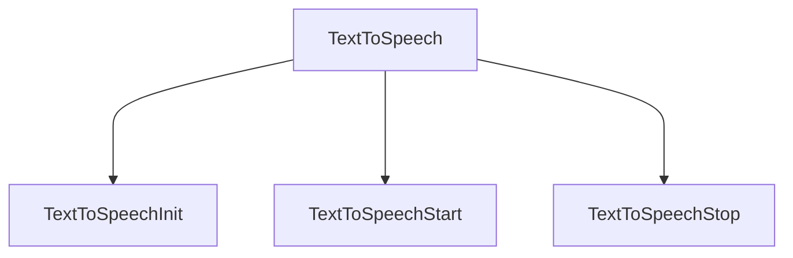

## 1. Happy Flow

```js
<VoiceRecognitionInit>
  <VoiceRecognitionIcon>
    Voice Icon
  </VoiceRecognitionIcon>
  <VoiceRecognitionModal>
    <div>Voice Modal</div>
  </VoiceRecognitionModal>
</VoiceRecognitionInit>
```



