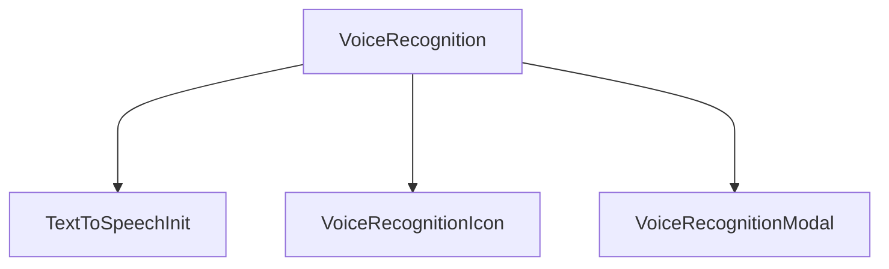

## 1. Happy Flow

```js
<TextToSpeech.Init text="Password field is not contained in a form: (More info: ">
  <TextToSpeech.Start>TextToSpeech-Start</TextToSpeech.Start>
  <TextToSpeech.Stop>TextToSpeech-Stop</TextToSpeech.Stop>
</TextToSpeech.Init>
```



