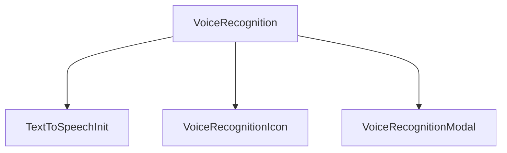

## 1. Happy Flow
#### a) Passing child
<TextToSpeech text="Password field is not contained in a form: (More info: ">
  <TextToSpeechStart>TextToSpeech-Start Icon/Text/Component</TextToSpeechStart>
  <TextToSpeechStop>TextToSpeech-Stop Icon/Text/Component-Stop</TextToSpeechStop>
</TextToSpeech>

## 2. Success: successCb callBack Fn along with success msg

> [!Note]
> **successCb** will get an object contains the property **msgType**, **msg**, **data**

## 3. Failure: failureCb callBack Fn along with failure msg

> [!Note]
> **failureCb** will get an object contains the property **msgType**, **msg**

> [!Important]
Failure can happend due to multiple reasons, due to that reason **failureMsg** is an object having different kind of error property according to the error can occur in component

## 4. Failure: Device don't support the feature and you want to hide the feauture from User

> [!Note]
> if **showForever** props value is false, feature will be hidden in case of unSupported by the device

## 5. Combine with all props

